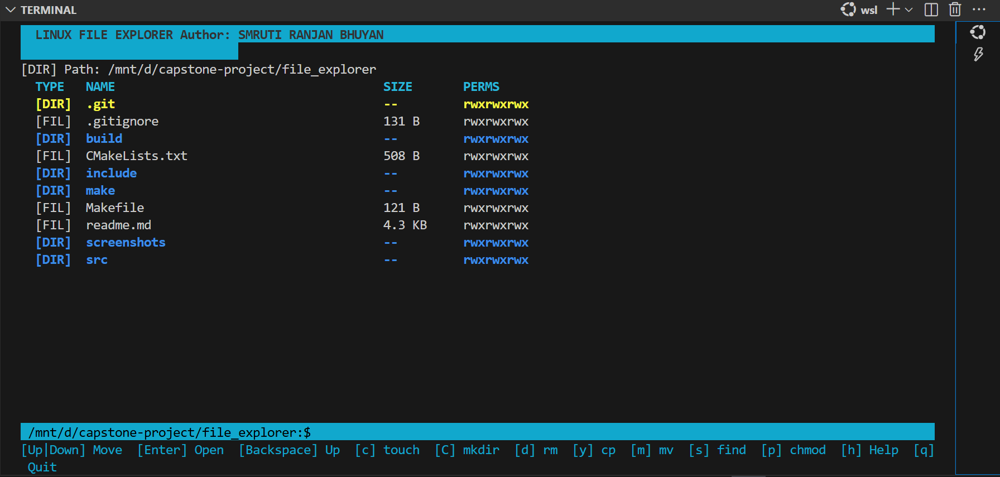
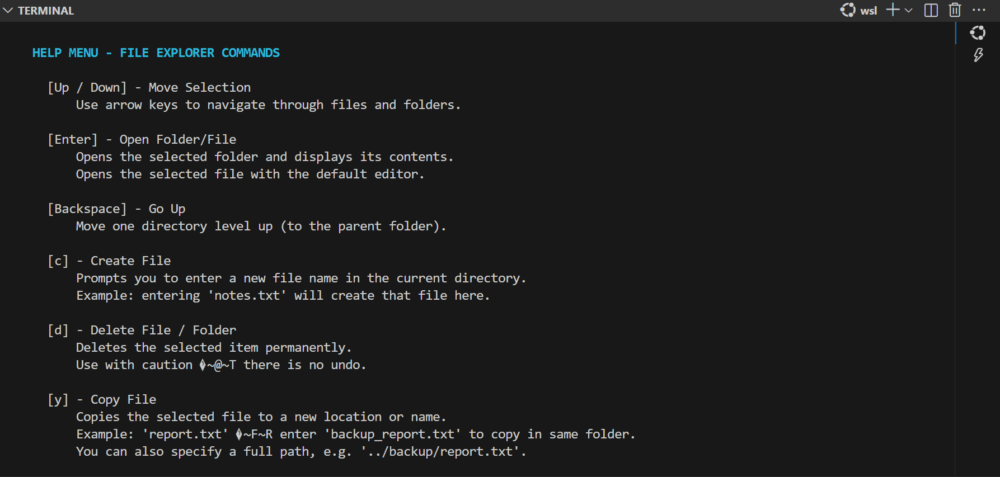
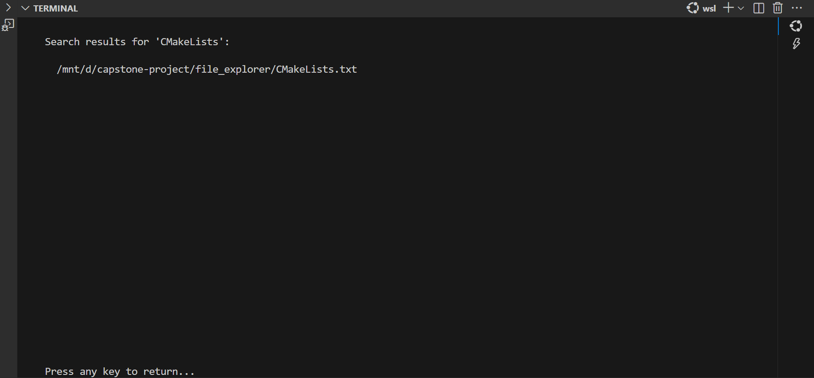

# File Explorer (C++ + ncurses)

A simple, keyboard-driven file explorer for Linux terminals, built with C++ and ncurses. Browse directories, manage files/folders, and perform operations without a mouse.


[](https://isocpp.org/)
[](https://www.linux.org/)

## Table of Contents
- [Overview](#overview)
- [Features](#features)
- [Prerequisites](#prerequisites)
- [Installation](#installation)
- [Building](#building)
- [Running](#running)
- [Usage](#usage)
- [Screenshots](#screenshots)
- [Project Structure](#project-structure)
- [Contributing](#contributing)
- [License](#license)
- [Author](#author)

## Overview
This project provides a terminal-based file explorer for Linux, using C++ and the ncurses library for a responsive, color-coded UI. It's ideal for command-line environments where mouse input is unavailable.

## Features
- **Navigation**: Browse folders with arrow keys, Enter, and Backspace.
- **File Operations**: Create, delete, copy, move, and rename files/folders.
- **Permissions Management**: View and edit Unix-style permissions (e.g., `rwxr-xr--`).
- **Search**: Recursive search for files by keyword.
- **File Info**: Display type (DIR/FIL), size, and permissions.
- **UI**: Colorful, responsive interface with built-in help.
- **Cross-Platform**: Primarily Linux; experimental macOS support.

## Prerequisites
- **OS**: Linux (Ubuntu/WSL tested; macOS experimental).
- **Compiler**: g++ (GCC 7+) or CMake.
- **Library**: ncurses (for UI).

## Installation
Install dependencies:

### Ubuntu/Debian (including WSL):
```bash
sudo apt update
sudo apt install g++ libncurses5-dev libncursesw5-dev cmake -y
```

### Fedora/CentOS/RHEL:
```bash
sudo dnf install gcc-c++ ncurses-devel cmake
```

### Arch Linux:
```bash
sudo pacman -S gcc ncurses cmake
```

### macOS (Homebrew):
```bash
brew install gcc ncurses cmake
```
*Note: macOS features like permissions may differ.*

## Building
1. Clone the repo:
   ```bash
   git clone https://github.com/file-explorer-smruti
   cd file_explorer
   ```
2. Build with CMake:
   ```bash
   mkdir build
   cd build
   cmake ..
   make
   ```
   Or with Makefile:
   ```bash
   make
   ```

## Running
Run the executable:
```bash
./file_explorer
```
Or:
```bash
make run
```
Starts in the current directory.

## Usage
Interface shows path, file list (type, name, size, perms), and footer.

### Key Bindings
- **Navigation**:
  - `↑/↓`: Move selection.
  - `Enter`: Open folder.
  - `Backspace`/`←`: Go up.
- **Operations**:
  - `c`: Create file.
  - `C`: Create directory.
  - `d`: Delete (no undo).
  - `y`: Copy.
  - `m`: Move/rename.
- **Other**:
  - `s`: Search.
  - `p`: Edit permissions (format: `rwxrwxrwx`).
  - `h`: Help.
  - `q`: Quit.

### Permissions
Unix-style: `rwxr-xr--` (owner/group/others).
Edit with 9 chars, e.g., `rwxr--r--`.

### Tips
- Starts in launch directory.
- Search is case-sensitive.
- Use search for large dirs.
- Press any key to dismiss messages.

## Screenshots
### Main Interface


### Help Menu


### Search Results


## Project Structure
```
file_explorer/
├── .git/
├── .gitignore
├── CMakeLists.txt
├── Makefile
├── readme.md
├── include/
│   ├── FileManager.h
│   └── UIManager.h
└── src/
    ├── main.cpp
    ├── FileManager.cpp
    └── UIManager.cpp
```
- `src/main.cpp`: Entry point, ncurses init.
- `src/FileManager.cpp/h`: File operations.
- `src/UIManager.cpp/h`: UI management.
- `CMakeLists.txt`: Build script.
- `Makefile`: Alternative build.
- `.gitignore`: Excludes artifacts.

## Contributing
1. Fork the repo.
2. Create a feature branch (`git checkout -b feature/xyz`).
3. Commit changes (`git commit -m 'Add xyz'`).
4. Push (`git push origin feature/xyz`).
5. Open a Pull Request.


## Author
**Smruti Ranjan Bhuyan** - [GitHub](https://github.com/smrutiranjanbhuyan)
